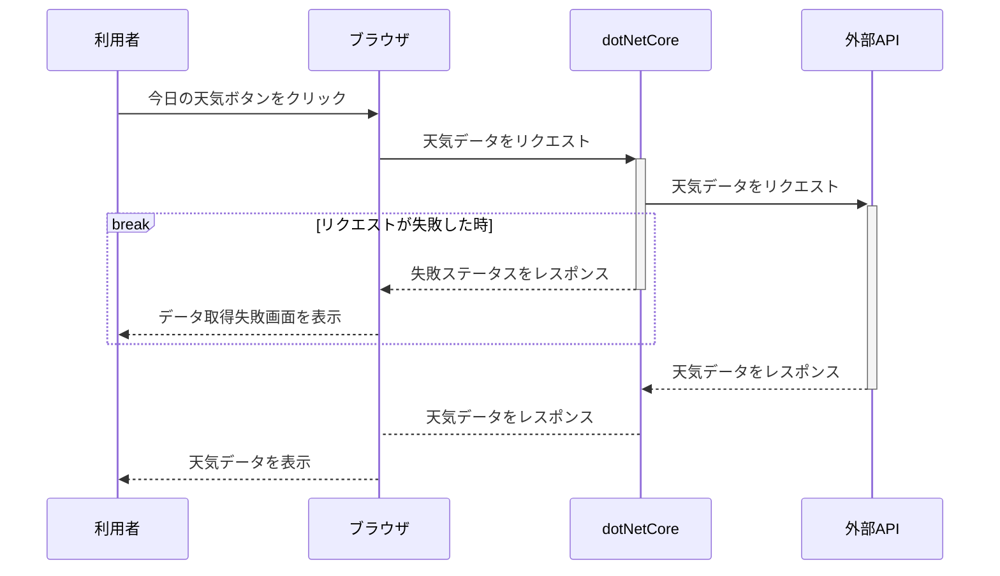

# React-TODO
ASP.NET Core Web API側からデータを取得して、その内容をブラウザに表示する流れを理解するためのWeb App

### 流れ

```mermaid
sequenceDiagram
    利用者->>ブラウザ: 今日の天気ボタンをクリック
    ブラウザ->>+dotNetCore: 天気データをリクエスト
    dotNetCore->>+外部API: 天気データをリクエスト
    break リクエストが失敗した時
        dotNetCore-->>-ブラウザ: 失敗ステータスをレスポンス
        ブラウザ-->>利用者: データ取得失敗画面を表示
    end
    外部API-->>-dotNetCore: 天気データをレスポンス
    dotNetCore-->ブラウザ: 天気データをレスポンス
    ブラウザ-->>利用者: 天気データを表示
```

### 構成
- ASP.NET Core 7.0
- React.js v18.0.2
- Typescript
