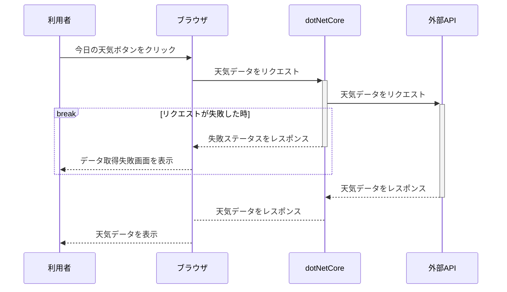

URL
https://reactcs.azurewebsites.net/
ホスト: Microsoft Azure
### 作成意図
- ASP.NET Core Web API側からデータを取得して、その内容をブラウザに表示する流れを理解するために作成しました。
- 静的型付け言語の学習を通してruby(動的型付け言語)の理解を深めるためにC#を触りました。
### 流れ

`src/components/FetchData.js` ：FetchDataページ用のコンポーネント。ASP.NET Core Web API側からデータを取得して、その内容を画面に表示する

### 構成
- ASP.NET Core 7.0
- React.js v18.0.2
- Typescript
